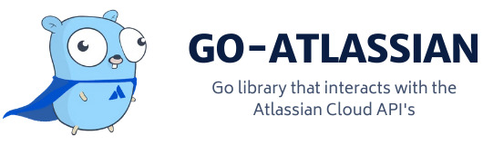

<p align="center"></p>

<p align="center">
    <a href="https://github.com/ctreminiom/go-atlassian/releases/latest"></a>
    <a href="https://pkg.go.dev/github.com/ctreminiom/go-atlassian"></a>
    <a href="https://goreportcard.com/report/github.com/ctreminiom/go-atlassian"></a>
    <a href="https://app.fossa.com/projects/git%2Bgithub.com%2Fctreminiom%2Fgo-atlassian?ref=badge_shield" alt="FOSSA Status"></a>
    <a href="https://codecov.io/gh/ctreminiom/go-atlassian"></a>
    <a href="https://www.codacy.com/gh/ctreminiom/go-atlassian/dashboard?utm_source=github.com&amp;utm_medium=referral&amp;utm_content=ctreminiom/go-atlassian&amp;utm_campaign=Badge_Grade"></a>
    <a href="https://github.com/ctreminiom/go-atlassian/blob/master/LICENSE"></a>
    <a href="https://github.com/ctreminiom/go-atlassian/actions?query=workflow%3ATesting"></a>
    <a href="https://docs.go-atlassian.io/"></a>
     <a href="https://bestpractices.coreinfrastructure.org/projects/4861"></a> 
    <a href="https://discord.gg/yqaQFYHS"></a>
</p>

go-atlassian is a Go module that enables the interaction with the Atlassian Cloud Services.

## ✨ Features

### 🛫 Jira Software Cloud
- CRUD Application Roles, Dashboards, Filters, Groups, Issues.
- Search Issues using the JQL query.
- Add attachments into JIRA issues, and transition issues.
- Creation of issue(s) using the instance custom_fields.
- Edit issues using the operation's method **(add,remove,replace).**
- Assign issues and send custom mail notifications.
- CRUD the Issue Field Configuration, Issue Type Screen Scheme, and Permission Scheme.
- CRUD custom_fields contexts and options.
- Link issues and create new issue link types.
- Get the issue priorities and resolutions.
- CRUD Screen Screens, Screens and Screen Tabs.
- CRUD issue votes and watchers.
- CRUD Jira Project(s), Project Categories, Project Components, Project Versions.
- CRUD Project Roles and add/remove project actors(users).
- Validate new Jira Project Name or Key.
- Add Jira Field into Screen.
- Get or Cancel Jira Async Task(s).
- CRUD Jira Users and Search users.
- Check the user permissions

### 🛬 Jira Service Management Cloud
- CRUD JSM Customer(s).
- Search JSM Knowledgebase Articles.
- CRUD JSM Organizations and manipulates the Organization's Users.
- Get(s) and Answer Approval(s) and SLA(s).
- CRUD JSM Feedback(s) and Participant(s).
- Get(s) JSM Projects and Queues.
- CRUD JSM Request Types.

### 🛸 Atlassian Admin Cloud    
- Get Organization(s), Verified Domain(s), Audit Log(s), and Event Actions.
- CRUD Organization Polities.
- Enable/Disable an Organization User.
- Get/Update Organization User.
- Get/Delete Organization User Token(s).
- Create/Deactivate/Get(s)/Update/Path SCIM User(s).
- Create/Get(s)/Update/Delete SCIM Group(s).
- Get SCIM Schema(s).

### 🛰️ Confluence Cloud
- In Development 🔨

### 🚠 Jira Agile Cloud
- Get the board backlogs issues.
- Get the board configuration (Filter, Admin, Columns, etc).
- Create a new Jira Board.
- Extract the Epics associated with a board ID.
- Get the boards are linked to the same filter ID.
- Get a board by ID.
- Get the board issues.
- Get the board issues linked to the Epic.
- Get the board issues are not linked to any Epic.
- Move the backlogs issues to the board (Kanban Backlog must be enabled).
- Get the projects associated to a board.
- Get the sprints linked to a board.
- Get the versions associated to the board.
- Get the Epic Metadata.
- Get the issues associated to the Epic Key.
- Create/Close/Delete/Get Sprints.
- Get the Sprint issues.
- Start a sprint.
- Path/Update sprint. (Name, Start/End Date, etc.)

##  🔰 Installation
Make sure you have Go installed (download). Version `1.13` or higher is required.
```sh
## Jira Software Cloud / Service Management Cloud / Jira Agile Cloud
$ go get -u -v github.com/ctreminiom/go-atlassian/jira/

## Atlassian Cloud Admin
$ go get -u -v github.com/ctreminiom/go-atlassian/admin/
```

## 📓 Documentation
Documentation is hosted live at https://docs.go-atlassian.io/

## 📝 Usage
More examples in `jira/examples` `admin/examples` `jira/sm/examples` directories. Here's a short example of how to get a Jira Issue:
````go
package main

import (
	"context"
	"github.com/ctreminiom/go-atlassian/jira"
	"log"
	"os"
)

func main() {

	var (
		host  = os.Getenv("HOST")
		mail  = os.Getenv("MAIL")
		token = os.Getenv("TOKEN")
	)

	atlassian, err := jira.New(nil, host)
	if err != nil {
		return
	}

	atlassian.Auth.SetBasicAuth(mail, token)

	issue, response, err := atlassian.Issue.Get(context.Background(), "KP-12", nil, []string{"transitions"})
	if err != nil {
		if response != nil {
			log.Println("Response HTTP Response", string(response.BodyAsBytes))
			log.Println(response.StatusCode)
		}
		log.Fatal(err)
	}

	log.Println("Response HTTP Code", response.StatusCode)
	log.Println("HTTP Endpoint Used", response.Endpoint)

	log.Println(issue.Key)
	log.Println(issue.Fields.Reporter.AccountID)

	for _, transition := range issue.Transitions {
		log.Println(transition.Name, transition.ID, transition.To.ID, transition.HasScreen)
	}

}
````

## 🧳 JetBrains OS licenses
`go-atlassian` had been being developed with GoLand under the **free JetBrains Open Source license(s)** granted by JetBrains s.r.o., hence I would like to express my thanks here.

<p align="center" href="https://www.jetbrains.com/?from=go-atlassian" ></p>

## 🪐 GitBook Host
`go-atlassian` documentation is hosted using the GitBook non-profit / open-source plan so hence I would like to express my thanks here.

<p align="center"></p>

## ⭐️ Project assistance
If you want to say **thank you** or/and support active development of `go-atlassian`:

- Add a [GitHub Star](https://github.com/ctreminiom/go-atlassian) to the project.
- Write interesting articles about project on [Dev.to](https://dev.to/), [Medium](https://medium.com/) or personal blog.
- Support the project by donating a cup of coffee.
- Contributions, issues and feature requests are welcome!
-  Feel free to check [issues page](https://github.com/ctreminiom/go-atlassian/issues).
    
[](https://www.buymeacoffee.com/ctreminiom)

## 💡 Inspiration
The project was created with the purpose to provide a unique point to provide an interface for interacting with Atlassian products. This module is highly inspired by the Go library https://github.com/andygrunwald/go-jira
but focused on Cloud solutions.

## 🧪 Run Test Cases
```sh
go test -v ./...
```

## 💳 Credits
In addition to all the contributors we would like to thank these vendors:
- **Atlassian** for developing such a powerful ecosystem.
- **Gitbook** for provided full features for open-source projects

## 📝 License
Copyright © 2021 [Carlos Treminio](https://github.com/ctreminiom).
This project is [MIT](https://opensource.org/licenses/MIT) licensed.

[](https://app.fossa.com/projects/git%2Bgithub.com%2Fctreminiom%2Fgo-atlassian?ref=badge_large)
